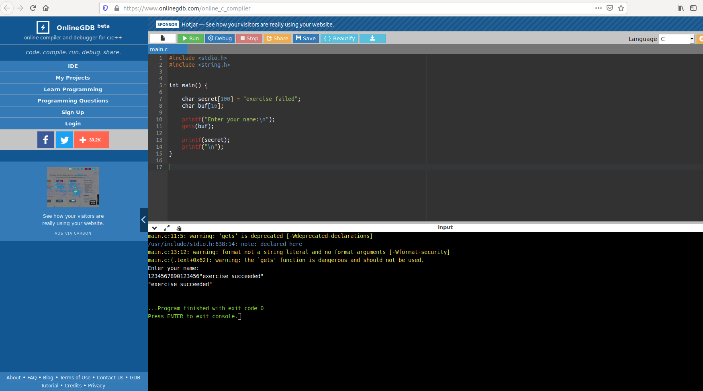

# Changing a variable without directly accessing it

Here we have provided with a C program and we have to change the variable directly without accessing it. 

Below is the source code of the program -

### Source code -

```
#include <stdio.h>

#include <string.h>


int main() {
 
    char secret[100] = "exercise failed";
    char buf[16];
 
    printf("Enter your name:\n");
    gets(buf);
 
    printf(secret);
    printf("\n");
}
```

As from the source code we can see that the buffer is having the 16 character limit.

So we can exploit the lmit of the buffer to get out desired message in the output without doing any changes in the source code.

We take the source code to a C compiler and perform our attack.

### Output -
```
/usr/include/stdio.h:638:14: note: declared here                                                                                                                                      
main.c:13:12: warning: format not a string literal and no format arguments [-Wformat-security]                                                                                        
main.c:(.text+0x62): warning: the `gets' function is dangerous and should not be used.                                                                                                
Enter your name:                                                                                                                                                                      
1234567890123456"exercie succeeded"                                                                                                                                                   
"exercie succeeded"                                                                                                                                                                                       
...Program finished with exit code 0 
``` 
Screenshot -  



### Strategy - 

we have just exceeded the limit of the buf input which in our case happens to be having the limit of 16 characters.

### Exploiting Technique -

we are performong the Buffer overflow attack on the program. 


