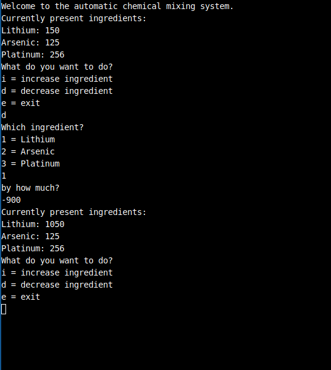
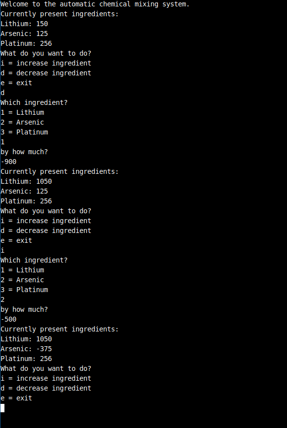

# Circumventing weak security checks

## Here we have given a C program of a Chemical factory control software on which we have perform a hack -

### Source Code -

``` 
#include <stdio.h>
#include <stdlib.h>
 
    int value_lithium = 150;
    int value_arsenic = 125;
    int value_platinum = 256;
 
    void printIngredients() {
        printf("Currently present ingredients:\n");
        printf("Lithium: %d\n", value_lithium);
        printf("Arsenic: %d\n", value_arsenic);
        printf("Platinum: %d\n", value_platinum);
    }
 
    void incIngredient(int *ingredient, int incValue) {
        if (*ingredient + incValue < 1000) {
            *ingredient = *ingredient + incValue;
        } else {
            printf("Cannot increase ingredient to more than 1000!\n");
            exit(-1);
        }
    }
 
    void decIngredient(int *ingredient, int decValue) {
        if (*ingredient - decValue > 0) {
            *ingredient = *ingredient - decValue;
        } else {
            printf("Cannot decrease ingredient to less than 0!\n");
            exit(-1);
        }
    }
 
    void executeCommand() {
        char input[20];
 
        printf("What do you want to do?\n"
                "i = increase ingredient\n"
                "d = decrease ingredient\n"
                "e = exit\n");
 
        fgets(input, sizeof(input), stdin);
         
        if (*input == 'e') {
            exit(0);
        }
         
        if (*input == 'i' || *input == 'd') {
            void (*operation)(int*, int);
 
            if (*input == 'i') {
                operation = &incIngredient;
            } else {
                operation = &decIngredient;
            }
 
            printf("Which ingredient?\n"
                "1 = Lithium\n"
                "2 = Arsenic\n"
                "3 = Platinum\n");
             
            fgets(input, sizeof(input), stdin);
            int value = atoi(input);
     
            int *ingredient;
 
            switch(value) {
                case 1:
                    ingredient = &value_lithium;
                    break;
                case 2:
                    ingredient = &value_arsenic;
                    break;
                case 3:
                    ingredient = &value_platinum;
                    break;
                default:
                    printf("You must provide an ingredient!\n");
                    exit(-1);
            }
 
            printf("by how much?\n");
 
            fgets(input, sizeof(input), stdin);
            operation(ingredient, atoi(input));
        } else {
            printf("Please provide a valid command.\n");
        }
    }
 
    int main() {
 
        printf("Welcome to the automatic chemical mixing system.\n");
        char input[10];
 
        while(1) {
            printIngredients();
            executeCommand();
        }
    }

```
### Increase - 

First we will increase the value of a chemical, for this we select 1st chemical which is Lithium. 

Screenshot-   


You can see that after our attack the value of the chemical Lithium is 1050 which can not be happened if the program runs properly without the hack.

### Decrease -

Now we will decrease the value of a chemical, for this we select the 2nd chemical which is Arsenic.

Screenshot-   


You can see that after our attack the value of Arsenic is -375 which is not according to the program.

### Outcome -

So the new value of Lithium is 1050 and Arsenic is -375, Which is what we need. 

## Possible solution to disable the security bypasses are - 

