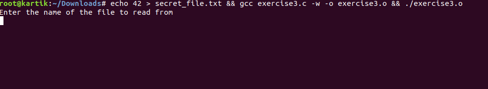
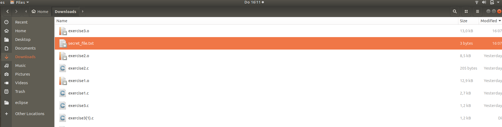
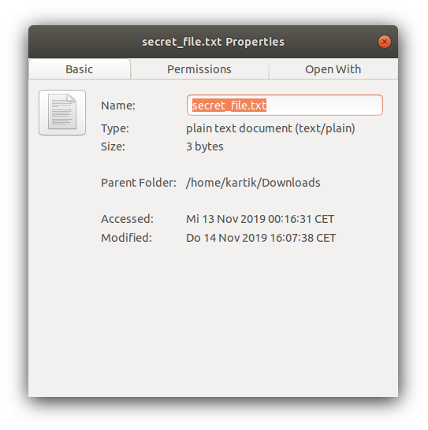
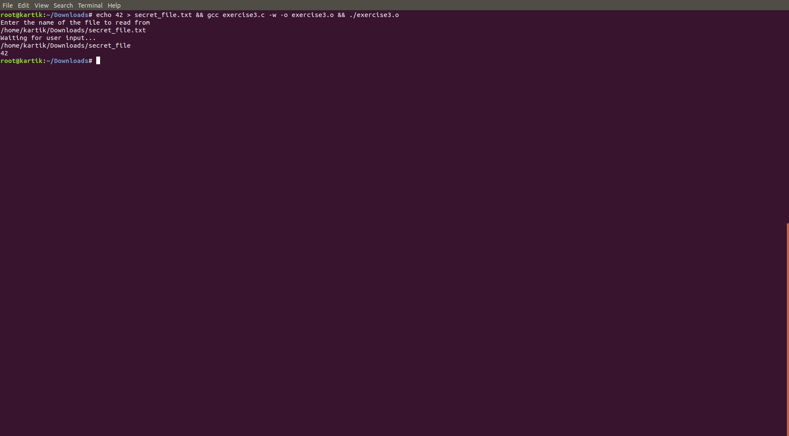

# Gaining access to restricted file

In this we have a C program in which we can access files which are available there, but we are not allowed to access the secret_file.txt or its link.

### So First we will run the command which is given in our exercise -

Screenshot-   

This will create the secret_file.txt in the location were we downloded our program file excersie3.c

Screenshot-   

### Now we will take the path of the secret_file.txt -

Screenshot-   

as you can see we get the path of the secret_file from its properties.

### Now we take this path and provide this as the input instead of the file name -

Screenshot-   

As you can see that we got the expected output from the above screenshot.

## THe security Bypass -

As you can see we can get the file by putting the file path instead of file name or its link, so file path is the security bypass we are using.

